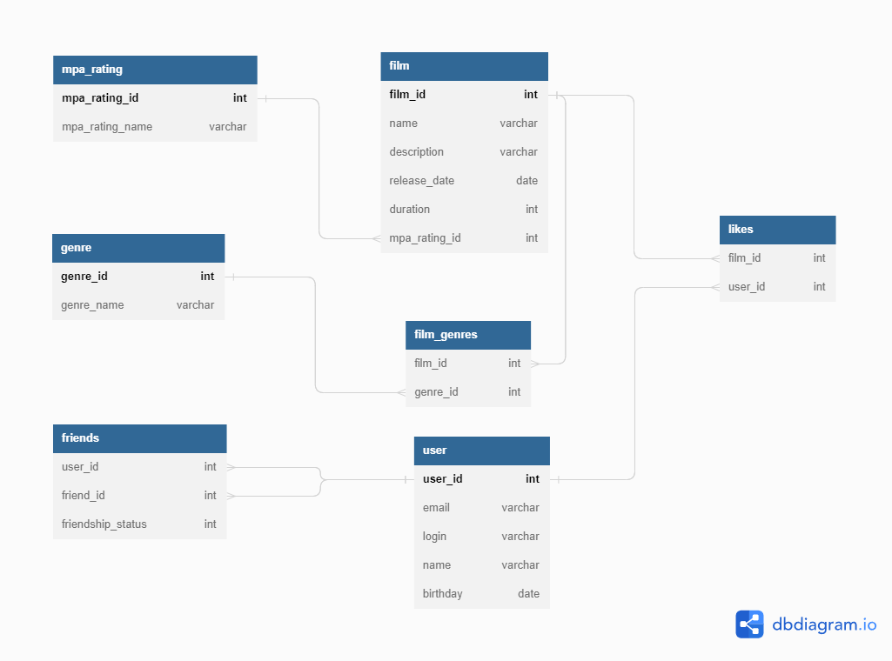

# java-filmorate

REST API сервис рейтинга фильмов

## Схема БД



### Описание таблиц БД

БД состоит из 7 таблиц:

1. ***film*** - хранит информацию о фильме (имя, описание, дата релиза, продолжительность, рейтинг, жанр)
2. ***mpa_rating*** - хранит перечисление возможных рейтингов.  
   Возможные варианты: G, PG, PG-13, R, NC-17.
3. ***genre*** - хранит перечисление возможных жанров.  
   Возможные варианты: comedy, drama, cartoon, thriller, documentary, action.
4. ***film_genres*** - хранит жанры фильмов.
5. ***user*** - хранит пользователей сервиса (почта, логин, имя, дата рождения)
6. ***likes*** - хранит лайки проставленные пользователями для конкретного фильма
7. ***friends*** - хранит информацию о дружбе пользователей и статусе дружбы.   
   Возможные статусы: дружба (1), запрос дружбы (2), заблокирован (3).

### Примеры запросов к таблицам

```sql
------------------------
--    Таблица film    --
------------------------

-- добавление нового фильма
INSERT
INTO film (film.name, film.descrioption, film.release_date, film.duration, film.mpa_rating_id)
VALUES ('film name', 'film description', '1970-01-01', 180, 1);

-- обновление фильма
UPDATE film
SET film.name='new name'
WHERE film.film_id = 1;

-- удаление фильма
DELETE
FROM film
WHERE film.film_id = 1;
```

```sql
------------------------
--    Таблица user    --
------------------------

-- добавление нового пользователя
INSERT
INTO user (user.email, user.login, user.name, user.birthday)
VALUES ('user@mail.ru', 'user_login', 'John', '1970-01-01');

-- обновление пользователя
UPDATE user
SET user.name='new name'
WHERE user.user_id = 1;

-- удаление пользователя
DELETE
FROM user
WHERE user.user_id = 1;
```

```sql
-------------------------
--    Таблица likes    --
-------------------------

-- добавление лайка фильму
INSERT
INTO likes (likes.film_id, likes.user_id)
VALUES (1, 1);

-- удаление лайка у фильма
DELETE
FROM likes
WHERE likes.film_id = 1
  AND likes.user_id = 1;
```

```sql
---------------------------
--    Таблица friends    --
---------------------------

-- запрос дружбы
INSERT
INTO friends (friends.user_id, friends.friend_id, friends.friendship_status)
VALUES (1, 2, 2);

-- подтвреждение запроса дружбы
UPDATE frineds
SET friends.friendship_status = 1
WHERE friends.user_id = 1
  AND friends.friend_id = 2;

-- удаление друга
DELETE
FROM friends
WHERE friends.user_id = 1
  AND friends.friend_id = 2;
```